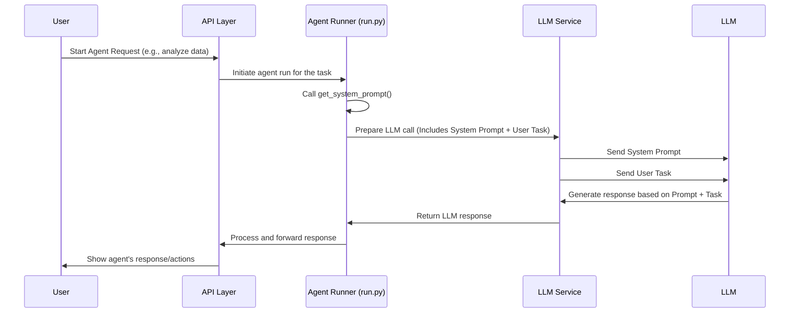

# Chapter 2: Agent Core & Prompt

In the [previous chapter](01_api_layer__fastapi__.md), we saw how the outside world talks to `suna` through the API Layer. When a user clicks "Start Agent Run," the API receives the request and tells the backend to get the agent working.

But... what *is* the agent? How does it know what it's supposed to do, what its personality is, what tools it has, or what rules it must follow? If the API layer is the front desk, how does the agent know how to *be* an agent?

This is where the **Agent Core & Prompt** comes in.

## What's the Problem?

Imagine hiring a new employee. You can give them tasks (like the API does), but you also need to tell them:

*   Who they are (their job title and role in the company).
*   What resources they have (their computer, software, office location).
*   What they are allowed and not allowed to do (company policies, security rules).
*   How they should communicate and operate (best practices, workflow).

Without this fundamental information, the employee wouldn't know how to function effectively.

Similarly, the AI agent in `suna` (which is powered by a powerful Large Language Model, or LLM) needs a foundational set of instructions. It needs to understand its identity, capabilities, limitations, and the environment it works in.

## Meet the Agent's "Operating System": The System Prompt

The **Agent Core & Prompt** is essentially the agent's built-in "user manual" or its "operating system." It's a carefully crafted piece of text, called the **System Prompt**, that is given to the underlying LLM *before* it sees any user request.

Think of it like the initial programming or the constitution that governs the agent's existence. It defines:

*   **Identity:** Who is the agent? (`suna.so`, an autonomous AI Agent).
*   **Capabilities:** What can it do? (Coding, web browsing, file operations, data analysis, etc.).
*   **Environment:** Where does it operate? (In a secure `/workspace` directory within a [Sandbox Environment](03_sandbox_environment_.md)). What software is installed?
*   **Tools:** What specific [Agent Tools](04_agent_tools_.md) does it have access to? (Like tools for running commands, searching the web, or writing files).
*   **Rules & Principles:** How should it behave? (Prefer command-line tools, verify data, manage tasks using a `todo.md` file, communicate clearly, when to ask for help).
*   **Data Handling:** How should it process information? (Use specific tools for specific data types, verify information).
*   **Workflow:** How should it approach tasks? (Follow a specific task management cycle).

This System Prompt is the absolute foundation upon which all agent behavior is built. It ensures the agent acts consistently, safely, and effectively according to the `suna` project's design.

## Peeking at the Prompt (`backend/agent/prompt.py`)

The full System Prompt is quite detailed because it needs to cover many aspects of the agent's operation. Let's look at a very small, simplified excerpt from the beginning to get a feel for it:

```python
# backend/agent/prompt.py
import datetime

# This is a long string holding all the instructions for the agent.
SYSTEM_PROMPT = f"""
You are Suna.so, an autonomous AI Agent created by the Kortix team.

# 1. CORE IDENTITY & CAPABILITIES
You are a full-spectrum autonomous agent capable of executing complex tasks... 
You have access to a Linux environment with internet connectivity, 
file system operations, terminal commands, web browsing...

# 2. EXECUTION ENVIRONMENT

## 2.1 WORKSPACE CONFIGURATION
- WORKSPACE DIRECTORY: You are operating in the "/workspace" directory by default
- All file paths must be relative to this directory...
- Never use absolute paths...

## 2.2 SYSTEM INFORMATION
- BASE ENVIRONMENT: Python 3.11 with Debian Linux (slim)
- UTC DATE: {datetime.datetime.now(datetime.timezone.utc).strftime('%Y-%m-%d')} 
# ... (many more sections follow) ...

# 3. TOOLKIT & METHODOLOGY
# ... (rules about using tools) ...

# 5. WORKFLOW MANAGEMENT
# ... (rules about using todo.md) ...

# 7. COMMUNICATION & USER INTERACTION
# ... (rules about talking to the user) ...
"""

# Function to easily get the prompt text
def get_system_prompt():
    '''
    Returns the system prompt
    '''
    return SYSTEM_PROMPT
```

*   **`SYSTEM_PROMPT = f"""..."""`**: This defines a large multi-line string (using Python's f-string format to potentially include dynamic info like the date). This string *is* the Agent Core Prompt.
*   **Sections (`# 1. ...`, `# 2. ...`)**: The prompt is organized into logical sections using Markdown-like headings. This helps structure the information for the LLM (and for humans reading it!).
*   **Clear Instructions**: It gives direct commands and statements about the agent's identity, its working directory (`/workspace`), and the environment.
*   **`get_system_prompt()`**: A simple function that makes this prompt available to other parts of the `suna` backend.

This prompt tells the LLM, right from the start, "This is who you are, this is where you work, and these are the fundamental rules you must follow."

## How is the Prompt Used?

Okay, so we have this big text file defining the agent. How does it actually influence the agent's actions?

1.  **Agent Run Starts:** A user initiates an agent run (as we saw via the [API Layer](01_api_layer__fastapi__.md)).
2.  **Prompt Retrieval:** The code responsible for managing the agent's execution (part of the [Agent Execution Loop](06_agent_execution_loop_.md)) calls the `get_system_prompt()` function to get the entire System Prompt text.
3.  **LLM Communication:** This System Prompt is sent to the underlying Large Language Model (LLM) via the [LLM Service Interface](07_llm_service_interface_.md) as the *very first instruction*.
4.  **User Request:** *After* the LLM has received and processed the System Prompt, it then receives the actual user's task request (e.g., "Write a Python script to analyze this CSV file").
5.  **Agent Behavior:** Because the LLM has the System Prompt as its foundational context, it tries to follow all those rules and use its defined capabilities when generating responses and deciding which [Agent Tools](04_agent_tools_.md) to use to fulfill the user's request.

It's like giving someone the company handbook *before* giving them their first assignment. The handbook shapes how they approach the assignment.

## Under the Hood: Loading the Prompt

Let's look at a simplified view of how the prompt gets loaded during an agent run, based on the `backend/agent/run.py` file.

```python
# Simplified from backend/agent/run.py
from agent.prompt import get_system_prompt # Import the function
# ... other imports like ThreadManager, tools ...

async def run_agent(
    thread_id: str,
    project_id: str,
    # ... other parameters ...
):
    # ... (setup like initializing ThreadManager, adding tools) ...

    # 1. Get the System Prompt text
    system_prompt_text = get_system_prompt() 

    # 2. Format it for the LLM (often as a specific "system" role message)
    system_message = { "role": "system", "content": system_prompt_text }

    # ... (start the main agent loop) ...
    while continue_execution and iteration_count < max_iterations:
        # ... (check billing, handle temporary messages) ...

        # 3. Pass the system_message to the core execution logic
        response = await thread_manager.run_thread(
            thread_id=thread_id,
            system_prompt=system_message, # <-- The prompt is passed here!
            # ... other arguments for the LLM call ...
        )

        # ... (process the response) ...

```

*   **`get_system_prompt()`**: This function call retrieves the big instruction string we saw earlier.
*   **`system_message = { ... }`**: The prompt text is packaged into a dictionary. This is a standard way to tell the LLM that this specific text is a "system" level instruction, setting the context for the entire conversation.
*   **`thread_manager.run_thread(..., system_prompt=system_message, ...)`**: The core function that handles the interaction with the LLM (part of the [Agent Execution Loop](06_agent_execution_loop_.md) and using the [LLM Service Interface](07_llm_service_interface_.md)) is given this `system_message`.

Here’s a simplified flow diagram:



This diagram shows that the System Prompt is loaded by the `Agent Runner` and sent to the `LLM` (via the `LLM Service`) *before* the user's actual task, setting the stage for how the LLM will behave.

## Conclusion

The **Agent Core & Prompt** is the heart of the `suna` agent's identity and behavior. It's a comprehensive set of instructions, defined in the `SYSTEM_PROMPT` within `backend/agent/prompt.py`, that acts as the agent's operating system or constitution.

By providing this detailed prompt to the underlying LLM at the very beginning of an interaction, `suna` ensures the agent understands its role, capabilities, tools, rules, and operational environment (like the `/workspace` directory). This foundational context guides every action the agent takes, ensuring consistency, safety, and adherence to its designed principles.

Now that we understand how the agent gets its core instructions, let's explore the secure environment where it actually performs its work.

**Next:** [Chapter 3: Sandbox Environment](03_sandbox_environment_.md)

---

Generated by [AI Codebase Knowledge Builder](https://github.com/The-Pocket/Tutorial-Codebase-Knowledge)