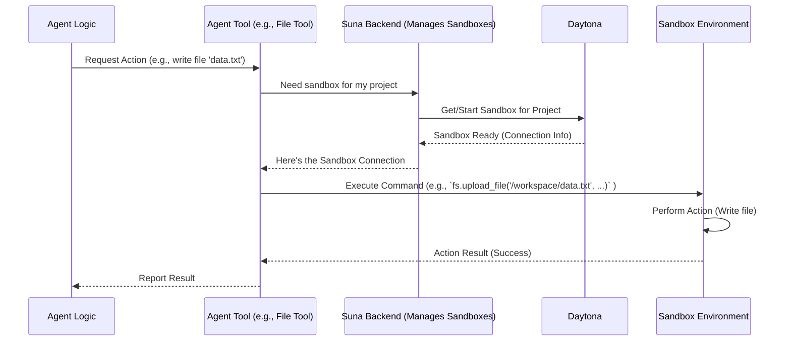

# Chapter 3: Sandbox Environment

In the [previous chapter](02_agent_core___prompt_.md), we learned how the `suna` agent gets its core identity and instructions through the System Prompt. It knows *who* it is and *what* rules to follow.

But where does the agent actually *do* its work? If you ask the agent to write a Python script and run it, where does that script get saved? Where does it get executed? How do we make sure the agent's actions don't accidentally mess up the main `suna` system or other users' work?

This is where the **Sandbox Environment** comes in.

## What's the Problem? Agents Need a Safe Place to Work

Imagine you hire a talented craftsperson. You give them instructions (like the System Prompt), but they also need a dedicated workshop. This workshop needs:

*   A workbench (a computer system).
*   Storage for materials and tools (a file system).
*   Maybe access to the outside world (network access).
*   A standard set of tools (pre-installed software).

Crucially, this workshop should be **isolated**. Whatever happens inside – sawdust flying, paint spills – shouldn't affect the rest of the building.

Our `suna` agent is like that craftsperson. It needs its own digital "workshop" to perform tasks like writing code, running commands, or browsing the web. We need to provide this workspace and ensure it's safe, consistent, and equipped with the necessary tools.

## Meet the Agent's Workshop: The Sandbox

The **Sandbox Environment** is exactly that: an isolated execution environment where the `suna` agent performs its tasks.

Think of it as the agent's own personal, temporary computer, specifically set up for the job at hand. Here’s what makes up this digital workshop:

1.  **A Linux System:** The sandbox provides a basic Linux operating system. This is the "workbench" where the agent can run commands and software. It's a familiar environment for many development tasks.
2.  **File Storage (`/workspace`):** The agent gets a dedicated directory called `/workspace`. This is like the workshop's storage shelf. Any files the agent creates (like code scripts, data files, notes) are saved here. The agent is specifically instructed (in its [System Prompt](02_agent_core___prompt_.md)) to always work within this directory.
3.  **Network Access:** The sandbox can connect to the internet. This allows the agent to do things like download software packages, fetch data from websites, or interact with online APIs (if needed for the task).
4.  **Pre-installed Tools:** The sandbox comes equipped with essential software that the agent might need, like Python, common command-line utilities, and potentially others. This ensures consistency – every agent starts with the same basic toolkit.
5.  **Isolation:** This is super important! Each agent run gets its *own* sandbox. What one agent does in its sandbox cannot directly affect another agent's sandbox or the main `suna` server. This keeps everything secure and prevents interference. If an agent makes a mistake (like deleting the wrong file), the damage is contained within its own temporary sandbox.
6.  **Managed by Daytona:** Under the hood, these sandboxes are actually sophisticated containers managed by a system called Daytona. You don't need to worry about the details of Daytona, just know that it's the technology responsible for creating, starting, stopping, and managing these isolated environments for `suna`.

## How Does the Agent Use the Sandbox?

The agent doesn't "log in" to the sandbox like a human would. Instead, it interacts with the sandbox using specialized [Agent Tools](04_agent_tools_.md).

Let's revisit our use case: The agent needs to write a Python script and run it.

1.  **Agent's Decision:** Based on the user request and its [System Prompt](02_agent_core___prompt_.md), the agent decides it needs to create a file and then execute it.
2.  **Using a File Tool:** The agent selects the appropriate [Agent Tool](04_agent_tools_.md) for file operations (like `create_file` or `full_file_rewrite`). It tells the tool: "Write the following Python code: `print('Hello from the Sandbox!')` into a file named `hello.py` inside `/workspace`."
3.  **Tool Interacts with Sandbox:** The file tool takes this instruction and communicates with the agent's specific Sandbox Environment. It uses the underlying Daytona system's capabilities to create the `hello.py` file with the specified content inside the `/workspace` directory of that sandbox.
4.  **Using a Shell Tool:** Next, the agent decides to run the script. It selects the shell execution tool (like `execute_command`). It tells the tool: "Run the command `python /workspace/hello.py`."
5.  **Tool Interacts with Sandbox:** The shell tool communicates with the same Sandbox Environment. It instructs the sandbox's Linux system to execute the Python interpreter on the `/workspace/hello.py` script.
6.  **Sandbox Executes:** The Linux environment inside the sandbox runs the command. The script prints "Hello from the Sandbox!".
7.  **Result Relayed Back:** The output ("Hello from the Sandbox!") is captured by the shell tool, sent back to the agent, which can then report the result to the user.

The agent directs the work, but the tools are the hands that interact with the sandbox environment to carry out the actions.

## Under the Hood: Getting Access to the Sandbox

How do the agent's tools know *which* sandbox to talk to and how to connect? This is managed behind the scenes.

When an agent run starts for a specific project, `suna` either finds the existing sandbox associated with that project or creates a new one using Daytona. Information about this sandbox (like its unique ID) is stored.

Tools designed to interact with the sandbox (like the file, shell, or browser tools) inherit from a base class (`SandboxToolsBase`) that knows how to get this sandbox connection information.



This diagram shows that the tool asks the `suna` backend for the correct sandbox, which interacts with Daytona. Once the tool has the connection, it can directly command the Sandbox Environment.

## Peeking at the Code (Simplified)

Let's see simplified examples of how tools get and use the sandbox connection.

First, how does a tool ensure it has access to the right sandbox? Tools often inherit from `SandboxToolsBase`, which has a helper method.

```python
# Simplified from backend/sandbox/sandbox.py (SandboxToolsBase)

from sandbox.sandbox import get_or_start_sandbox # Function to interact with Daytona
from agentpress.thread_manager import ThreadManager # Needed to access project data

class SandboxToolsBase(Tool):
    def __init__(self, project_id: str, thread_manager: ThreadManager):
        super().__init__()
        self.project_id = project_id
        self.thread_manager = thread_manager
        self._sandbox = None # Holds the connection object
        self._sandbox_id = None # Holds the sandbox ID

    async def _ensure_sandbox(self):
        """Make sure we have a connection to the project's sandbox."""
        if self._sandbox is None:
            # 1. Find the sandbox ID associated with this project_id
            # (Simplified - involves database lookup via thread_manager)
            self._sandbox_id = await self._get_project_sandbox_id(self.project_id)
            
            if not self._sandbox_id:
                raise ValueError(f"No sandbox found for project {self.project_id}")

            # 2. Use the sandbox_id to get the actual sandbox object
            #    This function talks to Daytona to get/start the sandbox.
            self._sandbox = await get_or_start_sandbox(self._sandbox_id)
            
            print(f"Tool connected to Sandbox: {self._sandbox_id}")
        
        return self._sandbox

    @property
    def sandbox(self):
        """Provides easy access to the sandbox object"""
        if self._sandbox is None:
            raise RuntimeError("Sandbox not ready. Call _ensure_sandbox() first.")
        return self._sandbox
```

This base class handles the logic of finding the right sandbox ID for the project and then calling `get_or_start_sandbox` (which interfaces with Daytona) to get a usable `sandbox` object.

Now, a specific tool like the File Tool can use this:

```python
# Simplified from backend/agent/tools/sb_files_tool.py

from sandbox.sandbox import SandboxToolsBase # Import base class

class SandboxFilesTool(SandboxToolsBase):
    # ... (init method calls super().__init__) ...

    async def create_file(self, file_path: str, file_contents: str):
        try:
            # 1. Make sure we have the sandbox connection
            await self._ensure_sandbox() 
            
            # Define the full path inside the sandbox
            full_path = f"/workspace/{file_path}" 

            # 2. Use the sandbox object to perform the action
            #    'self.sandbox' comes from the base class property
            #    'fs' is the filesystem interface provided by Daytona SDK
            self.sandbox.fs.upload_file(full_path, file_contents.encode()) 

            return self.success_response(f"File '{file_path}' created.")
        except Exception as e:
            return self.fail_response(f"Error: {str(e)}")

```

And the Shell Tool would do something similar for executing commands:

```python
# Simplified from backend/agent/tools/sb_shell_tool.py

from sandbox.sandbox import SandboxToolsBase, SessionExecuteRequest # Import base class and request model

class SandboxShellTool(SandboxToolsBase):
    # ... (init method calls super().__init__) ...

    async def execute_command(self, command: str, timeout: int = 60):
        try:
            # 1. Make sure we have the sandbox connection
            await self._ensure_sandbox()

            # Define the command request (simplified)
            # Ensures command runs inside /workspace
            full_command = f"cd /workspace && {command}"
            req = SessionExecuteRequest(command=full_command)

            # 2. Use the sandbox object to run the command
            #    'process' is the process execution interface
            response = self.sandbox.process.execute_session_command(
                session_id="default", # Simplified session handling
                req=req,
                timeout=timeout
            )

            if response.exit_code == 0:
                return self.success_response(f"Command output: {response.result}")
            else:
                return self.fail_response(f"Command failed: {response.result}")
        except Exception as e:
            return self.fail_response(f"Error: {str(e)}")
```

These examples show the pattern: the tool ensures it has a `sandbox` object via the base class, and then it uses methods on that object (like `sandbox.fs.upload_file` or `sandbox.process.execute_session_command`) to interact with the actual isolated environment.

## Conclusion

The **Sandbox Environment** is the agent's secure and private workshop. It's an isolated Linux environment, managed by Daytona, providing file storage (`/workspace`), network access, and essential tools.

This isolation is key for safety, preventing agent actions from affecting anything outside their designated area. It also ensures consistency, as every agent gets a standardized environment. The agent interacts with its sandbox not directly, but through specialized [Agent Tools](04_agent_tools_.md) for files, command execution, and more.

Now that we understand *where* the agent works (the Sandbox) and *how* it knows its basic rules ([Agent Core & Prompt](02_agent_core___prompt_.md)), let's look more closely at the specific tools it uses to interact with the sandbox and the outside world.

**Next:** [Chapter 4: Agent Tools](04_agent_tools_.md)

---

Generated by [AI Codebase Knowledge Builder](https://github.com/The-Pocket/Tutorial-Codebase-Knowledge)