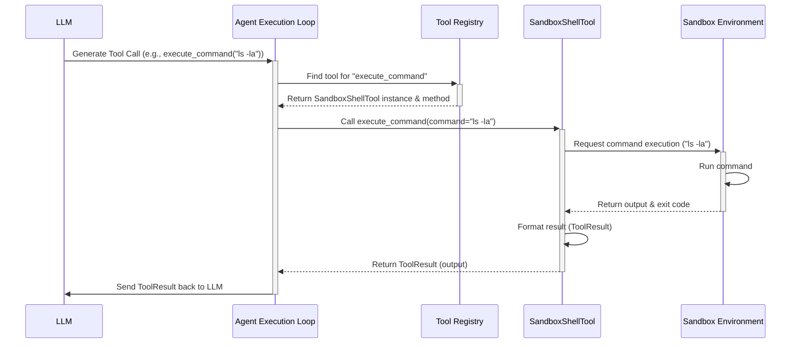

# Chapter 4: Agent Tools

In the [previous chapter](03_sandbox_environment_.md), we explored the **Sandbox Environment**, the secure and isolated workshop where the `suna` agent does its work. We saw that the agent has a dedicated `/workspace` directory and can run commands within this safe space.

But *how* does the agent actually interact with that sandbox? How does it run a command, create a file, search the web, or talk to a specific service like LinkedIn? It can't just "think" the command into existence. It needs specific capabilities.

This is where **Agent Tools** come into play.

## What's the Problem? Giving the Agent Abilities

Imagine you have a smartphone. The phone itself (the hardware and operating system) is like the agent's core and the sandbox. But to actually *do* things – browse the web, send messages, check the weather – you need apps!

Our `suna` agent is similar. It has its core intelligence (the LLM) and its safe workspace (the Sandbox), but it needs specific "apps" or "utilities" to perform concrete actions in the world. How can it:

*   Run a command like `ls -la` or `python script.py` in its [Sandbox Environment](03_sandbox_environment_.md)?
*   Create, read, or modify files in its `/workspace`?
*   Search the internet for information?
*   Interact with a web browser to fill out a form?
*   Fetch data from specific online services like [Data Providers](09_data_providers_.md) (e.g., Zillow, Yahoo Finance)?

The agent needs defined, reusable functions for these tasks.

## Meet the Agent's "Apps": Tools

**Agent Tools** are precisely these reusable capabilities or functions that the agent can call upon to perform specific actions. They are the agent's built-in toolkit.

Think of them like:

*   **Apps on a smartphone:** Each tool has a specific purpose (e.g., `execute_command`, `create_file`, `web_search`).
*   **Tools in a toolbox:** A plumber needs a wrench, a screwdriver, etc. Our agent needs tools for coding, file handling, web interaction, etc.

Examples of tools in `suna` include:

*   `SandboxShellTool`: For running commands in the [Sandbox Environment](03_sandbox_environment_.md).
*   `SandboxFilesTool`: For reading, writing, and managing files in `/workspace`.
*   `WebSearchTool`: For searching the web using services like Tavily.
*   `SandboxBrowserTool`: For controlling a web browser within the sandbox.
*   `DataProvidersTool`: For interacting with specific external data sources ([Data Providers](09_data_providers_.md)).
*   `MessageTool`: For communicating with the user (asking questions, providing updates).

### How Tools Describe Themselves: Schemas

Crucially, the agent (which is powered by an LLM) needs to know *how* to use each tool. What information does the `create_file` tool need? What will the `execute_command` tool give back?

This is where **schemas** come in. Each tool provides a description of itself, like a mini user manual or a function signature. These schemas tell the agent:

*   **What the tool does:** A brief description of its purpose.
*   **What inputs it needs:** The parameters (arguments) the agent must provide (e.g., for `create_file`, it needs `file_path` and `file_contents`).
*   **What outputs it produces:** What kind of result or information the tool will return upon success or failure.

`suna` primarily uses two formats for these schemas:

1.  **OpenAPI:** A standard JSON-based format often used for describing web APIs. This is compatible with many modern LLMs.
2.  **XML:** Another structured format that some LLMs (like Anthropic's Claude) use for describing tools.

These schemas allow the LLM to intelligently choose the right tool for a given task and format its request correctly.

## How Does the Agent Use a Tool?

Let's go back to our use case: The agent needs to run the command `ls -la` in its sandbox.

1.  **Agent's Goal:** The agent understands, based on the user's request or its own plan, that it needs to list the files in the current directory.
2.  **Consulting Tool Schemas:** The agent (LLM) looks at the list of available tools and their schemas (provided to it as part of its context, alongside the [System Prompt](02_agent_core___prompt_.md)). It sees the `SandboxShellTool` and its `execute_command` function, described something like this (simplified OpenAPI schema):

   ```json
   {
     "type": "function",
     "function": {
       "name": "execute_command",
       "description": "Execute a shell command in the workspace directory...",
       "parameters": {
         "type": "object",
         "properties": {
           "command": {
             "type": "string",
             "description": "The shell command to execute..."
           },
           // other optional parameters like folder, timeout...
         },
         "required": ["command"]
       }
     }
   }
   ```

3.  **Choosing the Tool:** The agent recognizes that `execute_command` matches its goal.
4.  **Formatting the Request:** The agent generates a request to use this tool, providing the required parameters. Depending on the LLM and configuration, this might look like a JSON object:

   ```json
   {
     "tool_name": "execute_command",
     "parameters": {
       "command": "ls -la"
     }
   }
   ```
   Or maybe an XML structure:
   ```xml
   <execute-command>
   ls -la
   </execute-command>
   ```

5.  **Execution:** The `suna` backend (specifically the [Agent Execution Loop](06_agent_execution_loop_.md)) receives this formatted request from the LLM.
6.  **Tool Invocation:** The backend identifies the tool (`execute_command`) and calls the corresponding Python function in the `SandboxShellTool` instance, passing the `command` parameter ("ls -la").
7.  **Action:** The `execute_command` function interacts with the [Sandbox Environment](03_sandbox_environment_.md) to run `ls -la`.
8.  **Result:** The sandbox returns the output (the file listing).
9.  **Response:** The tool formats this output into a `ToolResult` object (we'll see this later) and sends it back to the agent/LLM.
10. **Agent Continues:** The agent receives the file listing and can now use that information for its next step.

## Under the Hood: How Tools Work

Let's trace the journey of a tool call within `suna`.

1.  **LLM Decides:** The LLM, based on the conversation history and its goals, decides to use a tool (e.g., `execute_command`). It generates the structured request (JSON or XML).
2.  **Executor Parses:** The [Agent Execution Loop](06_agent_execution_loop_.md) receives the LLM's response containing the tool request. It parses this request to identify the tool name (`execute_command`) and the parameters (`{"command": "ls -la"}`).
3.  **Registry Lookup:** The executor consults the `ToolRegistry`. This registry holds all the available tool instances and knows which Python function corresponds to which tool name or XML tag. It finds the `execute_command` function within the `SandboxShellTool` instance.
4.  **Tool Execution:** The executor calls the actual Python function (`SandboxShellTool.execute_command(command="ls -la")`).
5.  **Tool Logic:** The Python code inside the `execute_command` function runs.
    *   It might first call `_ensure_sandbox()` (as seen in Chapter 3) to get a connection to the correct [Sandbox Environment](03_sandbox_environment_.md).
    *   It then uses the sandbox connection object (e.g., `self.sandbox.process.execute_session_command(...)`) to tell the sandbox to run the actual `ls -la` command.
6.  **Sandbox Action:** The sandbox environment executes the command.
7.  **Sandbox Result:** The sandbox captures the output (stdout/stderr) and exit code.
8.  **Tool Response Formatting:** The `execute_command` function receives the result from the sandbox. It uses helper methods like `self.success_response(...)` or `self.fail_response(...)` to package the output and exit code into a standard `ToolResult` object.
9.  **Executor Receives Result:** The [Agent Execution Loop](06_agent_execution_loop_.md) gets the `ToolResult`.
10. **Feedback to LLM:** The result (e.g., the file listing or an error message) is formatted and sent back to the LLM as the outcome of the tool call, allowing the agent to continue its reasoning process.

Here’s a simplified diagram of this flow:



## Peeking at the Code

Let's look at the core building blocks.

**1. The Base Tool Class (`agentpress/tool.py`)**

All tools inherit from a base `Tool` class. This provides common functionality, like creating standardized success/failure responses.

```python
# Simplified from agentpress/tool.py
from dataclasses import dataclass
import json

@dataclass
class ToolResult:
    """Container for tool execution results."""
    success: bool
    output: str # Can be JSON string or plain text

class Tool(ABC): # ABC means Abstract Base Class
    """Abstract base class for all tools."""
    # ... (schema registration logic) ...

    def success_response(self, data: Union[Dict[str, Any], str]) -> ToolResult:
        """Create a successful tool result."""
        if isinstance(data, str):
            text = data
        else:
            # Convert dicts to JSON strings for output
            text = json.dumps(data, indent=2)
        return ToolResult(success=True, output=text)

    def fail_response(self, msg: str) -> ToolResult:
        """Create a failed tool result."""
        return ToolResult(success=False, output=msg)

```

*   `ToolResult`: A simple container holding whether the tool worked (`success`) and the resulting output or error message (`output`).
*   `Tool`: The base class. Real tools will inherit from this.
*   `success_response`/`fail_response`: Helper methods that tools use to easily create `ToolResult` objects in a consistent format.

**2. Defining Schemas with Decorators (`agentpress/tool.py`)**

Tools use Python "decorators" (`@openapi_schema` and `@xml_schema`) right above their function definitions to attach the schema information.

```python
# Simplified from agentpress/tool.py

def openapi_schema(schema: Dict[str, Any]):
    """Decorator for OpenAPI schema tools."""
    def decorator(func):
        # Attaches the schema dictionary to the function
        if not hasattr(func, 'tool_schemas'):
            func.tool_schemas = []
        func.tool_schemas.append(ToolSchema(schema_type=SchemaType.OPENAPI, schema=schema))
        return func
    return decorator

def xml_schema(tag_name: str, mappings: List[Dict] = None, example: str = None):
    """Decorator for XML schema tools."""
    def decorator(func):
        # Creates an XMLTagSchema object and attaches it
        xml_schema_obj = XMLTagSchema(tag_name=tag_name, example=example)
        # ... (code to process mappings) ...
        if not hasattr(func, 'tool_schemas'):
            func.tool_schemas = []
        func.tool_schemas.append(ToolSchema(schema_type=SchemaType.XML, schema={}, xml_schema=xml_schema_obj))
        return func
    return decorator
```

*   These decorators take the schema definition (as a dictionary for OpenAPI, or tag name/mappings for XML) and store it internally associated with the Python function they decorate. The `ToolRegistry` later reads this stored information.

**3. Example Tool: `SandboxShellTool` (`backend/agent/tools/sb_shell_tool.py`)**

Here's a simplified version of the `execute_command` tool method:

```python
# Simplified from backend/agent/tools/sb_shell_tool.py
from agentpress.tool import ToolResult, openapi_schema, xml_schema
from sandbox.sandbox import SandboxToolsBase # Base class for sandbox tools
from sandbox.sandbox import SessionExecuteRequest # Data structure for request

class SandboxShellTool(SandboxToolsBase): # Inherits from base sandbox tool

    # ... ( __init__ method ) ...

    @openapi_schema({ # <-- OpenAPI schema definition
        "type": "function",
        "function": {
            "name": "execute_command",
            "description": "Execute a shell command...",
            "parameters": {
                # ... parameters like 'command', 'folder', 'timeout' ...
            },
            "required": ["command"]
        }
    })
    @xml_schema( # <-- XML schema definition
        tag_name="execute-command",
        mappings=[{"param_name": "command", "node_type": "content", "path": "."}],
        example='<execute-command>ls -la</execute-command>'
    )
    async def execute_command(
        self,
        command: str,
        folder: Optional[str] = None,
        # ... other params
        timeout: int = 60
    ) -> ToolResult:
        try:
            # 1. Ensure sandbox connection is ready (from base class)
            await self._ensure_sandbox()

            # 2. Prepare the command (e.g., add 'cd /workspace/folder && ...')
            cwd = self.workspace_path
            if folder:
                cwd = f"{self.workspace_path}/{folder.strip('/')}"
            full_command = f"cd {cwd} && {command}"

            # 3. Prepare the request object for the sandbox
            req = SessionExecuteRequest(command=full_command)

            # 4. Call the sandbox process execution method
            response = self.sandbox.process.execute_session_command(
                session_id="default", # Use a session
                req=req,
                timeout=timeout
            )

            # 5. Check the result and return ToolResult
            if response.exit_code == 0:
                # Use success_response helper from base Tool class
                return self.success_response({"output": response.result, "exit_code": 0})
            else:
                # Use fail_response helper
                return self.fail_response(f"Command failed (Code {response.exit_code}): {response.result}")

        except Exception as e:
            # Handle unexpected errors
            return self.fail_response(f"Error executing command: {str(e)}")

```

*   **Inheritance:** It inherits from `SandboxToolsBase` (which itself inherits from `Tool`) to get sandbox connection logic and the `success/fail_response` methods.
*   **Decorators:** `@openapi_schema` and `@xml_schema` define how the agent should call this function.
*   **Core Logic:** The function prepares the command, uses `self.sandbox.process.execute_session_command` to interact with the actual [Sandbox Environment](03_sandbox_environment_.md), and then uses the helper methods to return a structured `ToolResult`.

**4. Tool Registry (`agentpress/tool_registry.py`)**

This class is responsible for finding and managing all the tools. When the application starts, it creates instances of tools like `SandboxShellTool`, `SandboxFilesTool`, etc., and registers them.

```python
# Simplified from agentpress/tool_registry.py
from agentpress.tool import Tool, SchemaType

class ToolRegistry:
    def __init__(self):
        self.tools = {} # For OpenAPI lookup by function name
        self.xml_tools = {} # For XML lookup by tag name

    def register_tool(self, tool_class: Type[Tool], **kwargs):
        tool_instance = tool_class(**kwargs)
        # Iterate through methods with schemas attached by decorators
        for func_name, schema_list in tool_instance.get_schemas().items():
            for schema in schema_list:
                if schema.schema_type == SchemaType.OPENAPI:
                    self.tools[func_name] = { # Store instance and schema
                        "instance": tool_instance,
                        "schema": schema
                    }
                elif schema.schema_type == SchemaType.XML and schema.xml_schema:
                    self.xml_tools[schema.xml_schema.tag_name] = { # Store instance, method name, schema
                        "instance": tool_instance,
                        "method": func_name,
                        "schema": schema
                    }
    # ... methods to get tools by name or tag ...
```

The [Agent Execution Loop](06_agent_execution_loop_.md) uses this registry to look up the correct tool instance and method based on the name (`execute_command`) or tag (`<execute-command>`) provided by the LLM.

## Conclusion

Agent Tools are the fundamental building blocks that give the `suna` agent its ability to act. They are like specialized apps or utilities (e.g., `SandboxShellTool`, `WebSearchTool`) that the agent can invoke to perform actions like running commands, managing files, or searching the web.

Each tool defines its capabilities using schemas (OpenAPI or XML), allowing the agent (LLM) to understand how to use it. When the agent decides to use a tool, the backend uses the `ToolRegistry` to find the corresponding Python code, executes it (often interacting with the [Sandbox Environment](03_sandbox_environment_.md) or external services), and returns a structured `ToolResult` to the agent. This mechanism allows the agent to reliably interact with its environment and the wider digital world.

Now that we understand how tools provide specific actions, how do we manage the overall flow of conversation and the agent's state, including which tools have been used and what their results were? Let's explore the component responsible for managing these threads of interaction.

**Next:** [Chapter 5: ThreadManager (AgentPress)](05_threadmanager__agentpress__.md)

---

Generated by [AI Codebase Knowledge Builder](https://github.com/The-Pocket/Tutorial-Codebase-Knowledge)