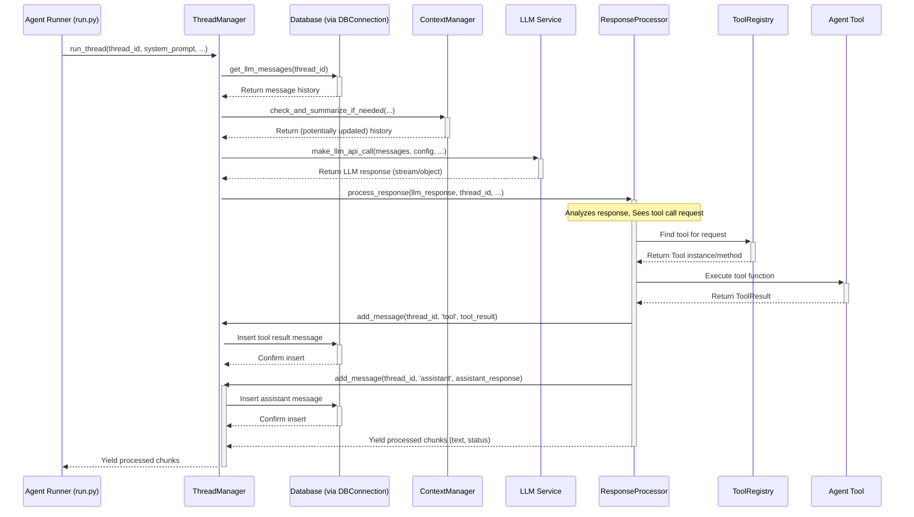

# Chapter 5: ThreadManager (AgentPress)

In the [previous chapter](04_agent_tools_.md), we learned about **Agent Tools** – the specific "apps" or capabilities the agent uses to perform actions like running code or searching the web. We saw how the agent can decide to use a tool and how that tool executes its task.

But wait a minute. How does the agent remember what the user asked for initially? How does it keep track of the conversation history – the user's messages, its own responses, and the results from the tools it used? If a task involves multiple steps and tool uses, how is all that managed?

Imagine you're managing a project. You need a central place to keep track of:

*   The project goal (the user's initial request).
*   All the communication back and forth.
*   Notes on tasks assigned to team members (tool calls).
*   Reports on completed tasks (tool results).
*   The overall progress and status.

Without this central management, the project would quickly become chaotic. Our AI agent needs a similar "project manager" for its tasks.

## What's the Problem? Managing the Conversation Flow

An AI agent doesn't just respond once. It often engages in a multi-turn conversation, potentially using multiple tools along the way. We need a system to:

1.  **Store the History:** Remember everything said by the user and the assistant, plus any tool interactions.
2.  **Orchestrate Turns:** Manage the flow – when to listen to the user, when to think (call the LLM), when to act (call a tool), and when to respond.
3.  **Maintain Context:** Keep track of the current state of the task or conversation.
4.  **Handle Persistence:** Save the conversation so it can be paused and resumed later.

This is the job of the **ThreadManager**.

## Meet the Conversation's "Project Manager": ThreadManager

The **ThreadManager** (part of the AgentPress framework within `suna`) is like the central coordinator or project manager for a specific agent task or conversation.

Think of each task the agent undertakes as a "thread" of execution. The `ThreadManager` is responsible for:

1.  **Managing Threads:** Each conversation or task run happens within a specific `thread_id`.
2.  **Storing Messages:** It saves all messages (user, assistant, tool calls, tool results) associated with that thread into a database ([Data Providers](09_data_providers_.md) via `DBConnection`). This provides the agent's memory for that task.
3.  **Retrieving Messages:** It fetches the relevant message history to give context to the agent (LLM) before it generates its next response.
4.  **Orchestrating Interactions:** It coordinates the back-and-forth between the user's input, the agent's "thinking" (calling the [LLM Service Interface](07_llm_service_interface_.md)), and the agent's "actions" (calling [Agent Tools](04_agent_tools_.md) via its internal `ResponseProcessor` and `ToolRegistry`).
5.  **Context Management:** It works closely with the [ContextManager (AgentPress)](08_contextmanager__agentpress__.md) to potentially summarize long conversations, ensuring the agent doesn't run out of "memory" (token limits) while still retaining important context.

Essentially, the `ThreadManager` holds the entire state and history of a specific job the agent is working on and manages its progression.

## How is the ThreadManager Used?

The main place we see the `ThreadManager` in action is within the [Agent Execution Loop](06_agent_execution_loop_.md) (specifically, the `run_agent` function in `backend/agent/run.py`).

Let's simplify the flow:

1.  **Start the Run:** When an agent run begins (triggered via the [API Layer (FastAPI)](01_api_layer__fastapi__.md)), the `run_agent` function gets called.
2.  **Initialize ThreadManager:** Inside `run_agent`, an instance of `ThreadManager` is created.
3.  **Add Tools:** The necessary [Agent Tools](04_agent_tools_.md) (like `SandboxShellTool`, `SandboxFilesTool`) are registered with the `ThreadManager` instance using its `add_tool` method. This tells the manager which tools are available for this run.
4.  **Start the Loop:** The code enters a loop to handle the back-and-forth conversation.
5.  **Call `run_thread`:** In each iteration, the core method `thread_manager.run_thread(...)` is called. This is where the magic happens!
    *   `run_thread` fetches the current conversation history using `get_llm_messages`.
    *   It might trigger context summarization via the [ContextManager (AgentPress)](08_contextmanager__agentpress__.md).
    *   It prepares the messages and sends them to the [LLM Service Interface](07_llm_service_interface_.md).
    *   It processes the LLM's response. If the LLM wants to use a tool, the `ThreadManager` (via its `ResponseProcessor`) finds and executes the tool using the `ToolRegistry`.
    *   It adds the LLM's response and any tool results back to the conversation history using `add_message`.
    *   It streams the results back to the `run_agent` function.
6.  **Loop Continues:** The loop in `run_agent` continues until the agent finishes the task or asks the user for input.

## Peeking at the Code (Usage in `run_agent`)

Let's look at a *very* simplified snippet from `backend/agent/run.py` to see how `ThreadManager` is used:

```python
# Simplified from backend/agent/run.py
from agentpress.thread_manager import ThreadManager
from agent.tools.sb_shell_tool import SandboxShellTool
from agent.tools.sb_files_tool import SandboxFilesTool
from agent.prompt import get_system_prompt
# ... other imports

async def run_agent(
    thread_id: str,
    project_id: str,
    # ... other parameters
):
    # 1. Initialize the ThreadManager
    thread_manager = ThreadManager()

    # 2. Register available tools
    thread_manager.add_tool(SandboxShellTool, project_id=project_id, thread_manager=thread_manager)
    thread_manager.add_tool(SandboxFilesTool, project_id=project_id, thread_manager=thread_manager)
    # ... add other tools ...

    # 3. Get the system prompt (Agent's core instructions)
    system_message = { "role": "system", "content": get_system_prompt() }

    # (Simplified loop - actual loop is more complex)
    while task_is_not_complete:
        # ... (Check billing, handle temporary messages like browser state) ...

        # 4. Call the ThreadManager to run one step of the conversation
        response_stream = await thread_manager.run_thread(
            thread_id=thread_id,
            system_prompt=system_message,
            stream=True, # Get responses as they come
            # ... other LLM config options ...
        )

        # 5. Process the stream of results (chunks)
        async for chunk in response_stream:
            # Yield chunk to the API layer / User Interface
            yield chunk
            # ... (Check if agent is done or needs input) ...

        # ... (Loop continuation logic) ...
```

*   **`ThreadManager()`**: Creates a new instance of our conversation manager.
*   **`thread_manager.add_tool(...)`**: Tells the manager which tools the agent can use for *this specific run*.
*   **`thread_manager.run_thread(...)`**: This is the core call. It handles fetching history, calling the LLM, executing tools if needed, saving results, and returning the response. It takes the `thread_id` to know which conversation it's managing.
*   **`async for chunk in response_stream:`**: The `run_thread` method (when `stream=True`) returns results piece by piece (like words appearing in a chat), which are then passed on.

## Under the Hood: What Happens Inside `run_thread`?

Okay, we call `thread_manager.run_thread()`. What actually happens inside the `ThreadManager`?

1.  **Fetch History:** It calls `get_llm_messages(thread_id)` to retrieve the relevant conversation history (user messages, assistant messages, tool results) from the database (via `DBConnection`).
2.  **Check Context Length:** It might check if the history is getting too long (using `litellm.token_counter`). If it exceeds a threshold, it calls the [ContextManager (AgentPress)](08_contextmanager__agentpress__.md) (`self.context_manager.check_and_summarize_if_needed(...)`) to condense older messages into a summary, saving "memory". If summarized, it fetches the updated history.
3.  **Prepare LLM Call:** It combines the system prompt, the fetched (and possibly summarized) history, and any temporary messages (like current browser state) into the format the LLM expects.
4.  **Call LLM:** It calls the `make_llm_api_call` function (part of the [LLM Service Interface](07_llm_service_interface_.md)), sending the prepared messages and configuration (model, temperature, tools schemas if needed).
5.  **Process Response:** It passes the raw LLM response (which could be a stream or a single object) to its internal `ResponseProcessor` (`self.response_processor.process_streaming_response(...)` or `process_non_streaming_response(...)`).
6.  **Handle Tool Calls (if any):** The `ResponseProcessor` analyzes the LLM response. If the LLM requested a tool call (e.g., `<execute-command>ls</execute-command>`), the processor uses the `ToolRegistry` (`self.tool_registry`) to find the correct tool function (e.g., `SandboxShellTool.execute_command`), executes it, and gets the `ToolResult`.
7.  **Save New Messages:** The `ResponseProcessor` (using the `add_message` callback passed during initialization) calls `thread_manager.add_message(...)` to save the assistant's response and any tool results back into the database for that `thread_id`.
8.  **Stream Results:** It yields the processed chunks (assistant text, tool status updates, tool results) back to the caller (`run_agent`).

Here’s a simplified sequence diagram:



## Peeking at the Code (Implementation in `ThreadManager`)

Let's look at simplified snippets from `backend/agentpress/thread_manager.py`.

**1. Initialization (`__init__`)**

```python
# Simplified from agentpress/thread_manager.py
from agentpress.tool_registry import ToolRegistry
from agentpress.context_manager import ContextManager
from agentpress.response_processor import ResponseProcessor
from services.supabase import DBConnection # Database connection

class ThreadManager:
    def __init__(self):
        """Initialize ThreadManager components."""
        self.db = DBConnection() # Get database connection manager
        self.tool_registry = ToolRegistry() # Manages available tools
        self.context_manager = ContextManager() # Manages context summarization

        # Processor handles LLM response parsing and tool execution.
        # It needs the registry and a way to add messages back.
        self.response_processor = ResponseProcessor(
            tool_registry=self.tool_registry,
            add_message_callback=self.add_message # Pass its own method
        )
        # ...
```

*   The `ThreadManager` creates instances of the `ToolRegistry`, `ContextManager`, `ResponseProcessor`, and gets a `DBConnection`.
*   Crucially, it gives its *own* `add_message` method to the `ResponseProcessor` so the processor can save messages back into the thread history managed by the `ThreadManager`.

**2. Adding Tools (`add_tool`)**

```python
# Simplified from agentpress/thread_manager.py
from agentpress.tool import Tool
from typing import Type, List, Optional

class ThreadManager:
    # ... (__init__) ...

    def add_tool(self, tool_class: Type[Tool], **kwargs):
        """Add a tool to the internal ToolRegistry."""
        # Delegates registration to the ToolRegistry instance
        self.tool_registry.register_tool(tool_class, **kwargs)
        print(f"Tool registered: {tool_class.__name__}")
```

*   This method simply passes the tool class and any arguments (like `project_id`) to the `ToolRegistry`, which handles the actual registration logic.

**3. Adding Messages (`add_message`)**

```python
# Simplified from agentpress/thread_manager.py
import json
from typing import Dict, Any, Union, Optional

class ThreadManager:
    # ... (__init__, add_tool) ...

    async def add_message(
        self,
        thread_id: str,
        type: str, # e.g., 'user', 'assistant', 'tool'
        content: Union[Dict[str, Any], List[Any], str],
        # ... other params like is_llm_message, metadata
    ):
        """Add a message to the thread in the database."""
        print(f"Adding message type '{type}' to thread {thread_id}")
        client = await self.db.client # Get the actual Supabase client

        # Prepare data for the 'messages' table
        data_to_insert = {
            'thread_id': thread_id,
            'type': type,
            # Store complex content as JSON string in the database
            'content': json.dumps(content) if isinstance(content, (dict, list)) else content,
            # ... other fields
        }

        try:
            # Insert into the database
            await client.table('messages').insert(data_to_insert).execute()
            # print(f"Successfully added message to thread {thread_id}")
        except Exception as e:
            print(f"ERROR adding message: {e}")
            raise
```

*   This method takes the message details (`thread_id`, `type`, `content`), formats them correctly (converting Python dicts/lists to JSON strings), and uses the `DBConnection` (`self.db.client`) to insert the message into the `messages` database table. This is how the conversation history is persistently stored.

**4. Running the Thread (`run_thread` - Core Logic Simplified)**

```python
# Simplified from agentpress/thread_manager.py
from services.llm import make_llm_api_call # Interface to LLM service
from agentpress.response_processor import ProcessorConfig
# ... other imports

class ThreadManager:
    # ... (other methods) ...

    async def run_thread(
        self,
        thread_id: str,
        system_prompt: Dict[str, Any],
        stream: bool = True,
        # ... llm_model, temporary_message, processor_config, etc.
        enable_context_manager: bool = True
    ) -> Union[Dict[str, Any], AsyncGenerator]:

        # --- Inner function to handle one cycle ---
        async def _run_once(temp_msg=None):
            try:
                # 1. Get history from DB
                messages = await self.get_llm_messages(thread_id)

                # 2. Check context length & Summarize if needed (using ContextManager)
                if enable_context_manager:
                    # Simplified call - actual call checks token count first
                    summarized = await self.context_manager.check_and_summarize_if_needed(
                        thread_id=thread_id, add_message_callback=self.add_message, #...
                    )
                    if summarized: messages = await self.get_llm_messages(thread_id) # Refresh if summarized

                # 3. Prepare messages for LLM (system + history + temp)
                prepared_messages = [system_prompt] + messages
                if temp_msg: prepared_messages.append(temp_msg)

                # 4. Get tool schemas if native tool calling is enabled
                openapi_tool_schemas = self.tool_registry.get_openapi_schemas() # If needed

                # 5. Call the LLM Service
                llm_response = await make_llm_api_call(
                    prepared_messages, llm_model, tools=openapi_tool_schemas, #...
                )

                # 6. Process the response (streaming or non-streaming)
                if stream:
                    response_generator = self.response_processor.process_streaming_response(
                        llm_response, thread_id, processor_config, #...
                    )
                    return response_generator # Return the generator
                else:
                    # Simplified non-streaming path
                    return await self.response_processor.process_non_streaming_response(
                         llm_response, thread_id, processor_config, #...
                    )

            except Exception as e:
                print(f"Error in _run_once: {e}")
                return {"status": "error", "message": str(e)}
        # --- End inner function ---

        # (Logic to handle auto-continuation if LLM uses tools)
        # ... calls _run_once potentially multiple times ...
        # For simplicity, we just call it once here:
        return await _run_once(temporary_message)

```

*   This highly simplified view shows the core steps: get messages (`get_llm_messages`), potentially summarize (`self.context_manager`), call the LLM (`make_llm_api_call`), and process the response (`self.response_processor`).
*   It coordinates the interaction between message storage (DB), context handling ([ContextManager (AgentPress)](08_contextmanager__agentpress__.md)), the LLM ([LLM Service Interface](07_llm_service_interface_.md)), and tool execution ([Agent Tools](04_agent_tools_.md) via `ResponseProcessor` and `ToolRegistry`).

## Conclusion

The **ThreadManager** is the central nervous system for managing an agent's task execution in `suna`. It acts like a project manager, keeping track of the entire conversation history (user input, assistant replies, tool actions) for a specific `thread_id` by storing and retrieving messages from the database.

It orchestrates the flow by calling the LLM for reasoning, coordinating with the `ResponseProcessor` and `ToolRegistry` to execute [Agent Tools](04_agent_tools_.md), and working with the [ContextManager (AgentPress)](08_contextmanager__agentpress__.md) to keep the conversation context manageable. The `run_thread` method is the key entry point that drives one step of the agent's execution cycle.

Now that we understand how the conversation state and flow are managed, let's look at the overall loop that uses the `ThreadManager` to drive the agent's execution from start to finish.

**Next:** [Chapter 6: Agent Execution Loop](06_agent_execution_loop_.md)

---

Generated by [AI Codebase Knowledge Builder](https://github.com/The-Pocket/Tutorial-Codebase-Knowledge)