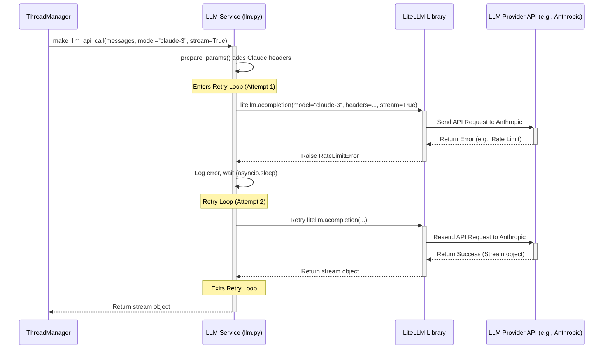

# Chapter 7: LLM Service Interface

In the [previous chapter](06_agent_execution_loop_.md), we saw how the **Agent Execution Loop** keeps the agent running, repeatedly asking the AI brain, "What's next?". This involves sending the conversation history and system instructions to a Large Language Model (LLM) and getting back the next action or response.

But which LLM? There are many powerful AI models out there – OpenAI's GPT-4, Anthropic's Claude 3, Google's Gemini, and more. Each has its own way of being "talked to" – its own specific API rules, ways to format requests, and ways to handle special features like using tools.

How can `suna` talk to *any* of these different LLMs without needing completely separate code for each one?

## What's the Problem? Speaking Many AI Languages

Imagine you're managing an international team. You need to give instructions, but your team members speak different languages (English, French, Japanese). You could learn all those languages yourself, which is difficult, or you could hire a universal translator who can take your instructions and relay them correctly to each team member in their own language.

`suna` faces a similar challenge. The core agent logic wants to send a request like: "Here's the conversation history, the system prompt, and the tools available. What should I do?" But sending this to GPT requires a different format than sending it to Claude.

We need a component that acts as that universal translator, handling the specific communication details for each LLM so the rest of `suna` doesn't have to worry about it.

**Use Case:** The [ThreadManager (AgentPress)](05_threadmanager__agentpress__.md), as part of the [Agent Execution Loop](06_agent_execution_loop_.md), needs to send the current conversation context (messages, system prompt, available tools) to the selected LLM (e.g., "claude-3-opus-20240229") and receive the agent's next thought or action, potentially as a stream of text.

## Meet the Universal Translator: The LLM Service Interface

The **LLM Service Interface** is `suna`'s universal translator for talking to different Large Language Models. It's a wrapper module that sits between the core agent logic and the various LLM APIs.

Think of it as a skilled diplomat who knows the specific customs and protocols needed to communicate effectively with dignitaries from different countries (LLMs).

Here’s what this translator does:

1.  **Uses LiteLLM:** It relies heavily on a powerful library called **LiteLLM**. LiteLLM is specifically designed to provide a *unified* way to call hundreds of different LLM APIs using a consistent format. Our interface builds upon LiteLLM.
2.  **Prepares Requests:** It takes the standard request from the [ThreadManager (AgentPress)](05_threadmanager__agentpress__.md) (messages, system prompt, tools) and formats it *exactly* how the target LLM (like Claude or GPT) expects it. This might involve adding special headers or structuring tool information differently.
3.  **Handles Responses:** It receives the response from the LLM and presents it back in a consistent way. This includes handling real-time **streaming** (where text appears word-by-word) and understanding when the LLM wants to use an [Agent Tool](04_agent_tools_.md).
4.  **Manages Errors & Retries:** What if the LLM service is temporarily busy or there's a network blip? The interface automatically tries the request again a few times (with delays) before giving up. This makes the agent more robust.
5.  **Abstraction:** Most importantly, it hides all the complexity of individual LLM APIs. The rest of `suna` just calls a simple function in this interface, tells it which model to use, and gets the result.

## How it Solves the Use Case

Let's revisit our use case: The [ThreadManager (AgentPress)](05_threadmanager__agentpress__.md) needs to get the next step from "claude-3-opus-20240229".

1.  **Gather Info:** The `ThreadManager` collects the system prompt, the message history, and the schemas for the available [Agent Tools](04_agent_tools_.md).
2.  **Call the Interface:** It calls the main function of the LLM Service Interface, `make_llm_api_call`, located in `backend/services/llm.py`.
3.  **Specify Model:** It passes the collected information along with the target model name: `model_name="claude-3-opus-20240229"` and might set `stream=True`.
4.  **Interface Does the Work:**
    *   `make_llm_api_call` sees the model name starts with "claude".
    *   It calls an internal helper (`prepare_params`) to add special headers required by Anthropic's API and format the messages and tools correctly for Claude.
    *   It uses `litellm.acompletion` (the core LiteLLM function) to send the formatted request to Anthropic's servers.
    *   It handles the streaming response coming back from Claude.
    *   If there's a temporary error (like a rate limit), it waits and retries automatically.
5.  **Consistent Result:** The `ThreadManager` receives the response stream from `make_llm_api_call`. It doesn't need to know *how* the interface talked to Claude; it just gets the result in a standard format. If the user later configured `suna` to use "gpt-4o" instead, the `ThreadManager`'s call would stay *exactly the same*, just changing the `model_name` parameter. The LLM Service Interface would handle the different communication protocol automatically.

## Under the Hood: A Request's Journey Through the Interface

Let's trace what happens inside `backend/services/llm.py` when `make_llm_api_call` is invoked.

1.  **Receive Request:** The `make_llm_api_call` function gets the messages, target `model_name`, streaming preference, tool definitions, etc.
2.  **Prepare Parameters (`prepare_params`):** It calls a helper function, `prepare_params`. This function looks at the `model_name` and adjusts the parameters accordingly:
    *   Is it a Claude model? Add Anthropic-specific headers (like `anthropic-beta`). Format prompt caching instructions.
    *   Is it an OpenRouter model? Add specific headers like `HTTP-Referer`.
    *   Is it a Bedrock model? Prepare AWS credentials.
    *   Format the `tools` list into the structure the specific model expects.
    *   Set the correct parameter name for `max_tokens` (different models use different names).
3.  **Enter Retry Loop:** The code enters a `for` loop that will try the API call up to `MAX_RETRIES` times.
4.  **Call LiteLLM (`litellm.acompletion`):** Inside the loop, the core step happens: `await litellm.acompletion(**params)`. This function from the LiteLLM library takes the carefully prepared parameters and does the heavy lifting:
    *   Determines the correct API endpoint based on the `model_name`.
    *   Formats the final HTTP request.
    *   Sends the request to the LLM provider (OpenAI, Anthropic, etc.).
    *   Handles receiving the response (or stream).
5.  **Handle Errors:** If `litellm.acompletion` fails (e.g., throws `litellm.exceptions.RateLimitError`), the `except` block catches it.
    *   The error is logged.
    *   The code waits for a short period (`asyncio.sleep(delay)`).
    *   The `for` loop continues to the next attempt.
6.  **Success:** If `litellm.acompletion` succeeds, the function immediately returns the response (or the stream object) it received from LiteLLM. The retry loop is exited.
7.  **Failure (Exhausted Retries):** If the loop finishes all attempts without success, an `LLMRetryError` is raised to signal that the call ultimately failed.

Here’s a sequence diagram illustrating this flow, including a retry scenario:



## Peeking at the Code (`backend/services/llm.py`)

Let's look at some simplified snippets from the core file.

**1. Setting up API Keys**

The interface needs the API keys for the different services. It reads them from the [Configuration Management](10_configuration_management_.md).

```python
# Simplified from backend/services/llm.py
import os
from utils.config import config # Access configuration
from utils.logger import logger
import litellm

def setup_api_keys() -> None:
    """Set up API keys from environment variables/config."""
    # Example for OpenAI and Anthropic
    if config.OPENAI_API_KEY:
        # LiteLLM reads OPENAI_API_KEY environment variable by default
        logger.debug("OpenAI API Key found.")
    if config.ANTHROPIC_API_KEY:
        # LiteLLM reads ANTHROPIC_API_KEY environment variable by default
        logger.debug("Anthropic API Key found.")
    # ... similar checks for Groq, OpenRouter, AWS Bedrock ...

# Run setup when the module is loaded
setup_api_keys()
```

This code simply checks if API keys are present in the configuration and logs messages. LiteLLM automatically picks up keys set as environment variables (which the config system often does).

**2. Preparing Parameters**

This function adjusts the request details based on the target model.

```python
# Simplified from backend/services/llm.py

def prepare_params(model_name: str, messages: list, tools: list = None, **kwargs) -> dict:
    """Prepare parameters for the LiteLLM API call."""
    params = {
        "model": model_name,
        "messages": messages,
        **kwargs # Include other args like temperature, stream, max_tokens
    }

    # Add tools if provided
    if tools:
        params["tools"] = tools
        params["tool_choice"] = "auto" # Default choice

    # Add Claude-specific headers if needed
    if "claude" in model_name.lower() or "anthropic" in model_name.lower():
        params["extra_headers"] = {
            "anthropic-beta": "output-128k-2025-02-19" # Example header
        }
        logger.debug("Added Claude-specific headers")
        # ... potentially more Claude-specific formatting ...

    # ... similar conditional logic for OpenRouter, Bedrock, etc. ...

    return params

```

This function checks the `model_name` and adds specific fields like `extra_headers` only when necessary.

**3. The Main API Call Function (with Retries)**

This is the core function that orchestrates the call using LiteLLM and handles retries.

```python
# Simplified from backend/services/llm.py
import asyncio
import litellm
from litellm import acompletion # Async completion function
from utils.logger import logger

MAX_RETRIES = 3
RETRY_DELAY = 5 # seconds

async def make_llm_api_call(
    messages: list,
    model_name: str,
    stream: bool = False,
    tools: list = None,
    # ... other args like temperature, max_tokens ...
) -> Union[Dict, AsyncGenerator]:
    """Make API call using LiteLLM with retries."""

    params = prepare_params(
        model_name=model_name,
        messages=messages,
        stream=stream,
        tools=tools,
        # ... pass other args ...
    )

    last_error = None
    for attempt in range(MAX_RETRIES):
        try:
            logger.debug(f"LLM call attempt {attempt + 1}/{MAX_RETRIES} to {model_name}")

            # *** The core call to LiteLLM ***
            response = await acompletion(**params)

            logger.debug(f"LLM call successful.")
            return response # Return on success

        except (litellm.exceptions.RateLimitError, litellm.exceptions.APIConnectionError) as e:
            last_error = e
            logger.warning(f"LLM call failed (Attempt {attempt + 1}): {e}. Retrying...")
            await asyncio.sleep(RETRY_DELAY * (attempt + 1)) # Exponential backoff

        except Exception as e:
            logger.error(f"Unexpected LLM error: {e}", exc_info=True)
            raise LLMError(f"API call failed: {e}") # Raise unexpected errors immediately

    # If loop finishes without success
    error_msg = f"LLM call failed after {MAX_RETRIES} attempts. Last error: {last_error}"
    logger.error(error_msg)
    raise LLMRetryError(error_msg)

```

*   **`prepare_params(...)`**: Calls the helper to get model-specific parameters.
*   **`for attempt in range(MAX_RETRIES):`**: Sets up the retry loop.
*   **`await acompletion(**params)`**: The crucial line where **LiteLLM** is called to perform the actual communication with the LLM provider.
*   **`try...except`**: Catches specific, retriable errors (like rate limits, connection issues).
*   **`asyncio.sleep(...)`**: Waits before the next retry attempt.
*   **`return response`**: If the call succeeds, the result is returned immediately.
*   **`raise LLMRetryError(...)`**: If all retries fail, a specific error is raised.

## Conclusion

The **LLM Service Interface** (`backend/services/llm.py`) is `suna`'s adaptable translator for communicating with a wide variety of Large Language Models. By leveraging the **LiteLLM** library, it provides a single, unified function (`make_llm_api_call`) that the rest of the application can use without worrying about the specific API details of each LLM provider.

It handles the crucial tasks of formatting requests correctly for the target model, interpreting responses (including streaming), and automatically retrying in case of temporary errors. This abstraction makes `suna` flexible, allowing users to easily switch between different LLMs, and robust, by gracefully handling common communication issues.

We've seen how the agent gets its instructions ([Agent Core & Prompt](02_agent_core___prompt_.md)), where it works ([Sandbox Environment](03_sandbox_environment_.md)), what tools it uses ([Agent Tools](04_agent_tools_.md)), how its conversation is managed ([ThreadManager (AgentPress)](05_threadmanager__agentpress__.md)), how it runs step-by-step ([Agent Execution Loop](06_agent_execution_loop_.md)), and how it talks to its AI brain (LLM Service Interface). But what happens when the conversation gets really long? How do we make sure the agent doesn't forget important details from the beginning? Let's explore how `suna` manages the agent's memory next.

**Next:** [Chapter 8: ContextManager (AgentPress)](08_contextmanager__agentpress__.md)

---

Generated by [AI Codebase Knowledge Builder](https://github.com/The-Pocket/Tutorial-Codebase-Knowledge)