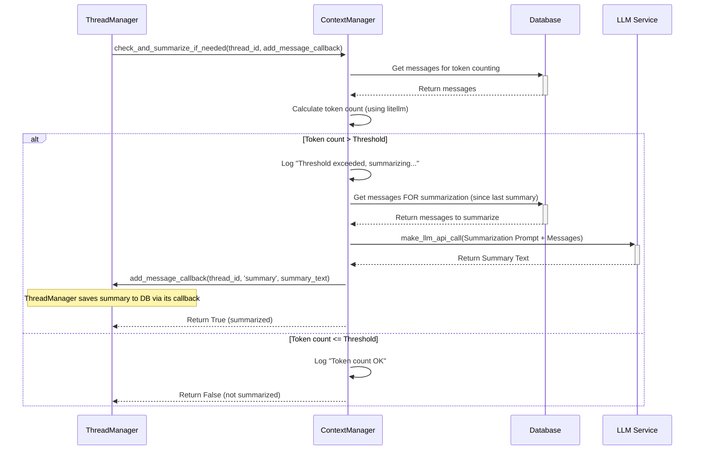

# Chapter 8: ContextManager (AgentPress)

In the [previous chapter](07_llm_service_interface_.md), we saw how `suna` uses the **LLM Service Interface** to talk to different AI brains (Large Language Models). This interface takes the conversation history and asks the LLM, "What should you do next?".

But what happens when the conversation gets really, really long? Imagine the agent has been working on a complex task for hours, generating lots of code, running commands, and exchanging many messages with you.

AI models, even powerful ones, have a limited "memory" or "attention span." They can only process a certain amount of text at once. This limit is called the **context window**. If the conversation history becomes longer than the context window, the AI might start "forgetting" things from the beginning of the conversation, or the request might fail entirely!

## What's the Problem? The Agent's Limited Memory

Think of the LLM's context window like a whiteboard. You can write down the conversation history on it for the AI to read. But the whiteboard has a fixed size. If the conversation gets too long, you run out of space!

You can't just erase the beginning of the conversation, because there might be important goals, decisions, or instructions written there. But you also can't just keep adding new messages, because you'll hit the limit.

How can we keep the *essential* information from the past, while still having space for the *new* parts of the conversation, without overflowing the whiteboard?

**Use Case:** The agent has been running for 50 steps. The conversation history (user messages, agent thoughts, tool outputs) is now very large, approaching the LLM's context window limit (e.g., 128,000 tokens). Before the [ThreadManager (AgentPress)](05_threadmanager__agentpress__.md) sends the history to the LLM for the 51st step, we need to make sure it fits, ideally by condensing the older parts without losing critical information.

## Meet the "Librarian": The ContextManager

This is where the **ContextManager** (part of the AgentPress framework within `suna`) comes in. It acts like a helpful librarian for the agent's conversation history.

The librarian's job is to keep the main reading desk (the LLM's context window) clear and focused on the current task, while carefully archiving older materials. Here's what the `ContextManager` does:

1.  **Monitors Size:** It keeps an eye on how long the conversation history is getting. It does this by calculating the number of "tokens" (pieces of words) in the messages.
2.  **Detects Overflow Risk:** It compares the current token count to a predefined limit (a threshold).
3.  **Summarizes:** If the history exceeds the threshold, the `ContextManager` takes the *older* part of the conversation (everything since the last summary, or everything if it's the first time) and asks *another* LLM call to create a concise summary of it. This summary captures the key points, decisions, and outcomes from that section.
4.  **Archives:** It saves this new summary message into the conversation history. Now, when the [ThreadManager (AgentPress)](05_threadmanager__agentpress__.md) fetches the history for the LLM, it can fetch the summary *instead* of all the individual messages that were summarized. This drastically reduces the token count while preserving essential context.

The `ContextManager` ensures the agent can have very long conversations without hitting the LLM's limits, maintaining a balance between remembering the past and processing the present.

## How is the ContextManager Used?

The `ContextManager` doesn't run on its own. It's used by the [ThreadManager (AgentPress)](05_threadmanager__agentpress__.md) as part of the [Agent Execution Loop](06_agent_execution_loop_.md).

Here's the simplified flow:

1.  **Agent Loop Runs:** The [Agent Execution Loop](06_agent_execution_loop_.md) tells the [ThreadManager (AgentPress)](05_threadmanager__agentpress__.md) to run the next step (`run_thread`).
2.  **ThreadManager Prepares:** Inside `run_thread`, before calling the main LLM, the `ThreadManager` needs to get the conversation history.
3.  **Context Check:** *Before* getting the final history, the `ThreadManager` calls the `ContextManager`'s `check_and_summarize_if_needed` method.
4.  **Manager Acts (If Needed):**
    *   The `ContextManager` calculates the current token count of the relevant history.
    *   If the count is over the `token_threshold` (e.g., 120,000 tokens), it triggers the summarization process:
        *   Fetches the messages needing summarization from the database.
        *   Calls the [LLM Service Interface](07_llm_service_interface_.md) (`make_llm_api_call`) with a special prompt asking it to summarize those messages.
        *   Receives the summary text from the LLM.
        *   Calls the `add_message` callback (provided by the `ThreadManager`) to save this summary as a new 'summary' type message in the database.
5.  **History Fetch:** The `ThreadManager` then calls its *own* `get_llm_messages` function. This function is smart enough to know that if a 'summary' message exists, it should fetch the summary *and only the messages that came after it*, effectively retrieving the condensed history.
6.  **LLM Call:** The `ThreadManager` proceeds with the LLM call, now using the potentially shorter, summarized history.

## Under the Hood: Checking and Summarizing

Let's visualize the flow when the `ThreadManager` calls `check_and_summarize_if_needed`:



This diagram shows the `ContextManager` checking the token count. If it's too high, it gets the relevant messages, uses the `LLM Service` to create a summary, and then uses the callback provided by the `ThreadManager` to save that summary back into the conversation history stored in the `Database`.

## Peeking at the Code (`backend/agentpress/context_manager.py`)

Let's look at simplified snippets to understand the core parts.

**1. Initialization (`__init__`)**

```python
# Simplified from agentpress/context_manager.py
from services.supabase import DBConnection
from utils.logger import logger

DEFAULT_TOKEN_THRESHOLD = 120000 # Default limit

class ContextManager:
    def __init__(self, token_threshold: int = DEFAULT_TOKEN_THRESHOLD):
        """Initialize the ContextManager."""
        self.db = DBConnection() # Needed to fetch messages
        self.token_threshold = token_threshold # Store the limit
        logger.info(f"ContextManager initialized with threshold: {self.token_threshold}")
```

*   This sets up the `ContextManager`, primarily storing the `token_threshold` which determines when summarization should happen. It also gets a database connection to fetch messages.

**2. Getting Token Count (`get_thread_token_count`)**

```python
# Simplified from agentpress/context_manager.py
from litellm import token_counter # Import litellm's counter

class ContextManager:
    # ... (init) ...

    async def get_messages_for_summarization(self, thread_id: str) -> list:
        # Simplified: Assume this function fetches messages from DB
        # based on the thread_id and the timestamp of the last summary.
        logger.debug(f"Fetching messages for summarization for {thread_id}...")
        # ... Database query logic ...
        messages = [] # Placeholder for fetched messages
        logger.debug(f"Fetched {len(messages)} messages.")
        return messages

    async def get_thread_token_count(self, thread_id: str) -> int:
        """Get the current token count for a thread using LiteLLM."""
        logger.debug(f"Getting token count for thread {thread_id}")
        try:
            # Get messages (potentially including older ones before summary)
            messages = await self.get_messages_for_summarization(thread_id)
            if not messages: return 0

            # Use litellm's accurate counter
            # Needs a model name for accurate counting, e.g., 'gpt-4'
            token_count = token_counter(model="gpt-4", messages=messages)

            logger.info(f"Thread {thread_id} token count: {token_count}")
            return token_count
        except Exception as e:
            logger.error(f"Error getting token count: {e}")
            return 0 # Return 0 on error
```

*   This function fetches the relevant messages from the database (details skipped for simplicity).
*   It then uses `litellm.token_counter`, passing the messages and a model name (different models count tokens slightly differently), to get an accurate count.

**3. Creating the Summary (`create_summary`)**

```python
# Simplified from agentpress/context_manager.py
from services.llm import make_llm_api_call # Use the LLM interface

SUMMARY_TARGET_TOKENS = 10000 # Aim for a summary around this size

class ContextManager:
    # ... (init, get_thread_token_count, get_messages_for_summarization) ...

    async def create_summary(
        self,
        thread_id: str,
        messages: list,
        model: str = "gpt-4o-mini" # Use a fast model for summarizing
    ) -> Optional[dict]:
        """Generate a summary of conversation messages."""
        if not messages: return None
        logger.info(f"Creating summary for {thread_id} using {model}")

        # Craft a detailed prompt for the LLM
        summarization_prompt = f"""
You are a summarization assistant. Create a concise but comprehensive summary
of the following conversation history. Preserve all key decisions, outputs,
and the latest state, so the conversation can resume from this summary.

CONVERSATION HISTORY:
{messages}
--- END OF HISTORY ---

Provide the summary now:
"""
        system_message = {"role": "system", "content": summarization_prompt}
        user_request = {"role": "user", "content": "PLEASE PROVIDE THE SUMMARY NOW."}

        try:
            # Call the LLM Service to generate the summary
            response = await make_llm_api_call(
                model_name=model,
                messages=[system_message, user_request],
                temperature=0, # Low temp for factual summary
                max_tokens=SUMMARY_TARGET_TOKENS,
                stream=False # Don't need streaming for summary
            )

            if response and hasattr(response, 'choices') and response.choices:
                summary_content = response.choices[0].message.content
                logger.info(f"Summary generated successfully for thread {thread_id}")
                # Format the summary message for storage
                summary_message = {
                    "role": "user", # Stored as 'user' role for context flow
                    "content": f"======== CONVERSATION HISTORY SUMMARY ========\n\n{summary_content}\n\n======== END OF SUMMARY ========\n\nThe conversation continues below."
                }
                return summary_message
            else:
                logger.error("Failed to generate summary: Invalid LLM response.")
                return None
        except Exception as e:
            logger.error(f"Error creating summary: {e}")
            return None
```

*   This function takes the messages needing summarization.
*   It creates a special `system_message` that instructs the LLM on *how* to summarize effectively.
*   It calls the main [LLM Service Interface](07_llm_service_interface_.md)'s `make_llm_api_call` function, using a potentially faster/cheaper model optimized for such tasks.
*   It extracts the summary text from the LLM's response and formats it nicely before returning.

**4. Checking and Summarizing (`check_and_summarize_if_needed`)**

This is the main entry point called by the `ThreadManager`.

```python
# Simplified from agentpress/context_manager.py

class ContextManager:
    # ... (other methods) ...

    async def check_and_summarize_if_needed(
        self,
        thread_id: str,
        add_message_callback, # Function from ThreadManager to save msg
        model: str = "gpt-4o-mini",
        force: bool = False # Option to force summarization
    ) -> bool:
        """Check if thread needs summarization and summarize if so."""
        try:
            # 1. Get current token count
            token_count = await self.get_thread_token_count(thread_id)

            # 2. Check if below threshold and not forced
            if token_count < self.token_threshold and not force:
                logger.debug(f"Token count {token_count} is below threshold {self.token_threshold}.")
                return False # No summary needed

            logger.info(f"Threshold triggered ({token_count}/{self.token_threshold}) or forced. Summarizing...")

            # 3. Get messages to be summarized
            messages_to_summarize = await self.get_messages_for_summarization(thread_id)
            if len(messages_to_summarize) < 3: # Don't summarize tiny histories
                 logger.info("Too few messages to summarize.")
                 return False

            # 4. Create the summary
            summary_message_obj = await self.create_summary(
                thread_id, messages_to_summarize, model
            )

            # 5. If summary was created, add it using the callback
            if summary_message_obj:
                await add_message_callback(
                    thread_id=thread_id,
                    type="summary", # Special type for summary message
                    content=summary_message_obj, # The dict created above
                    is_llm_message=True # It's part of LLM context
                )
                logger.info(f"Summary message added to thread {thread_id}.")
                return True # Summarization occurred
            else:
                logger.error(f"Failed to create or add summary for thread {thread_id}.")
                return False

        except Exception as e:
            logger.error(f"Error checking/summarizing: {e}")
            return False
```

*   This function orchestrates the process.
*   It gets the `token_count`.
*   It checks if the `token_threshold` is exceeded (or if `force` is True).
*   If needed, it calls `get_messages_for_summarization` and `create_summary`.
*   Crucially, if a `summary_message_obj` is created, it calls the `add_message_callback` function (which was passed in by the [ThreadManager (AgentPress)](05_threadmanager__agentpress__.md)) to actually save the summary message to the database history for that `thread_id`.
*   It returns `True` if a summary was successfully created and added, `False` otherwise.

## Integration with ThreadManager

Finally, let's see where this check happens inside the `ThreadManager`'s `run_thread` method (from `backend/agentpress/thread_manager.py`):

```python
# Simplified snippet from agentpress/thread_manager.py

class ThreadManager:
    # ... (init, add_tool, add_message, get_llm_messages) ...

    async def run_thread(
        self,
        thread_id: str,
        # ... other parameters ...
        enable_context_manager: bool = True # Flag to enable/disable
    ):
        # ... (setup) ...

        async def _run_once(temp_msg=None):
            try:
                # ... (get initial messages) ...

                # <<<--- CONTEXT MANAGER CHECK ---<<<
                if enable_context_manager:
                    logger.debug("Checking context manager...")
                    summarized = await self.context_manager.check_and_summarize_if_needed(
                        thread_id=thread_id,
                        add_message_callback=self.add_message, # Pass its own method!
                        model=llm_model, # Use the run's main model or specific summary model
                    )
                    if summarized:
                        logger.info("Context summarized, fetching updated messages.")
                        # Refresh messages after summarization
                        messages = await self.get_llm_messages(thread_id)
                # >>>--- END OF CONTEXT MANAGER CHECK ---<<<

                # ... (prepare messages for LLM using potentially updated 'messages') ...

                # ... (call make_llm_api_call) ...

                # ... (process response) ...

            except Exception as e:
                # ... (error handling) ...
        # ... (looping/auto-continue logic) ...
        return await _run_once(temporary_message) # Simplified call
```

*   Notice the `enable_context_manager` flag allows turning this feature on/off.
*   The `ThreadManager` calls `self.context_manager.check_and_summarize_if_needed`.
*   It passes its *own* `self.add_message` method as the `add_message_callback`. This allows the `ContextManager` to add the summary message back into the history managed by the `ThreadManager`.
*   If summarization occurred (`summarized` is True), the `ThreadManager` fetches the messages *again* using `self.get_llm_messages` to get the updated, shorter history including the new summary.

## Conclusion

The **ContextManager** is `suna`'s intelligent "librarian," ensuring that conversations with the agent can run for a long time without hitting the LLM's context window limits. It monitors the conversation's token count and, when a threshold is reached, automatically generates a concise summary of older messages using an LLM call.

This summary replaces the detailed older messages in the context sent to the main LLM, significantly reducing the token count while preserving the essential information needed for the agent to continue effectively. It integrates seamlessly with the [ThreadManager (AgentPress)](05_threadmanager__agentpress__.md) to perform this check before each main LLM interaction.

We've now seen how the agent thinks, acts, remembers, and manages its memory. But where does data like user profiles, project details, or conversation history actually get stored and retrieved from? Let's explore the components responsible for interacting with databases and other data sources next.

**Next:** [Chapter 9: Data Providers](09_data_providers_.md)

---

Generated by [AI Codebase Knowledge Builder](https://github.com/The-Pocket/Tutorial-Codebase-Knowledge)