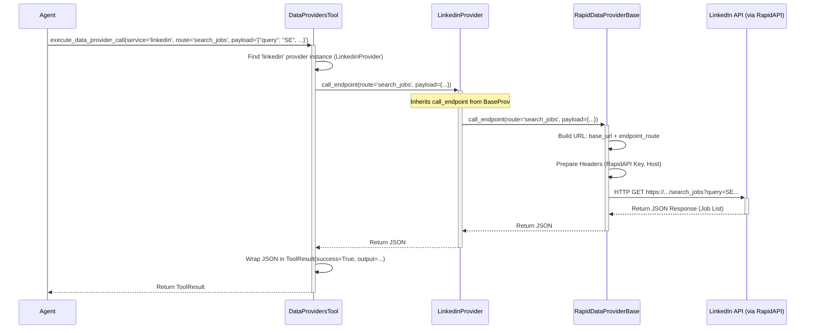

# Chapter 9: Data Providers

Welcome back! In the [previous chapter](08_contextmanager__agentpress__.md), we learned how the **ContextManager** helps our agent handle long conversations without forgetting important details by summarizing older parts of the discussion.

Now, let's think about where the agent gets specific, reliable information. Sometimes, the agent needs more than just general web search results. It might need to know:

*   "What are the latest job postings for 'Software Engineer' on LinkedIn?"
*   "What is the current estimated value (Zestimate) of the house at 123 Main Street on Zillow?"
*   "What are the recent tweets from user @suna_ai on Twitter?"

Trying to find this information by just reading websites ([web scraping](04_agent_tools_.md)) can be tricky. Websites change their layout, information might be hidden behind logins, and extracting the exact data needed can be unreliable. Wouldn't it be better if the agent could just ask the service (like LinkedIn or Zillow) directly in a structured way?

## What's the Problem? Getting Reliable, Structured Data

Imagine you need the official phone number for a specific government department. You *could* search the web and hope you find the right number on some random website, but it might be outdated or incorrect. The *best* way is to consult the official government directory.

Our `suna` agent faces a similar situation. When it needs precise, up-to-date, structured information from specific online services (like LinkedIn, Zillow, Twitter, Amazon, Yahoo Finance, etc.), relying on general web browsing or scraping isn't ideal. We need a way for the agent to consult the "official directory" for each service.

## Meet the "Information Desks": Data Providers

**Data Providers** in `suna` are exactly that: standardized ways for the agent to access structured data directly from specific external services using their official Application Programming Interfaces (APIs).

Think of each Data Provider as a specialized **information desk** for a particular service:

*   There's a LinkedIn desk, a Zillow desk, a Twitter desk, etc.
*   Each desk knows how to answer specific questions (these are called **endpoints**). For example, the LinkedIn desk might have endpoints for "search for people," "get company details," or "search for jobs."
*   The agent can go to the correct desk (Data Provider) and ask a specific question (call an endpoint) using a predefined format.
*   The desk (Data Provider) uses the official channels (the service's API) to get the information.
*   It returns the answer to the agent in a clean, structured format (usually JSON data).

Crucially, the agent is designed to **prefer using a Data Provider** when one is available for the required information, rather than trying to scrape a website. This leads to much more reliable and accurate results.

## How Data Providers Solve Our Use Case (LinkedIn Job Search)

Let's revisit our use case: The agent needs to find recent job postings for "Software Engineer" on LinkedIn.

1.  **Agent's Goal:** Find LinkedIn jobs for "Software Engineer".
2.  **Agent Considers Tools:** The agent looks at its available [Agent Tools](04_agent_tools_.md). It sees generic tools like web search, but it also sees a specialized `DataProvidersTool`.
3.  **Agent Prefers Specific Tool:** Recognizing the need for LinkedIn data, the agent decides the `DataProvidersTool` is the best option.
4.  **Agent Needs Endpoint Info:** "Okay, I need to use the `DataProvidersTool` for the 'linkedin' service. What specific actions (endpoints) can the LinkedIn provider perform?"
5.  **Agent Uses Discovery Tool:** The agent might first call the `DataProvidersTool`'s `get_data_provider_endpoints` function, asking for the endpoints of the `linkedin` service.
    *   **Input:** `service_name="linkedin"`
    *   **Output:** A list describing available LinkedIn endpoints, including one like `search_jobs` with its description and required parameters (`query`, `page`, `sortBy`, etc.).
6.  **Agent Chooses Endpoint:** The agent sees the `search_jobs` endpoint and decides it's the right one.
7.  **Agent Uses Execution Tool:** The agent now calls the `DataProvidersTool`'s `execute_data_provider_call` function.
    *   **Input:** `service_name="linkedin"`, `route="search_jobs"`, `payload='{"query": "Software Engineer", "sortBy": "DD"}'` (Note: payload is often sent as a JSON string).
8.  **Data Provider Works:** The `DataProvidersTool` directs this request to the `LinkedinProvider`, which handles the communication with the actual LinkedIn API (via a service called RapidAPI).
9.  **Structured Result:** The `LinkedinProvider` gets the job listings back as structured data (JSON).
10. **Agent Receives Data:** The `DataProvidersTool` returns this structured data to the agent, which can then easily read and present the job listings.

This process is much more reliable than trying to scrape the LinkedIn website.

## Under the Hood: How They Work Together

There are a few key pieces working together:

1.  **`RapidDataProviderBase`:** Many external APIs can be accessed conveniently through a platform called RapidAPI. `suna` uses a base class (`RapidDataProviderBase`) that contains the common logic for talking to APIs via RapidAPI. This includes handling the base URL, adding the necessary API keys (which we'll cover in [Chapter 10: Configuration Management](10_configuration_management_.md)), and making the actual web requests (HTTP GET or POST).
2.  **Specific Providers (e.g., `LinkedinProvider`, `ZillowProvider`, `TwitterProvider`, etc.):** Each of these classes represents one "information desk." They *inherit* from `RapidDataProviderBase`. Their main job is to define the specific **endpoints** they support. This is usually done by creating a dictionary mapping an endpoint key (like `"search_jobs"`) to a schema describing the API route (`/search_jobs`), the HTTP method (`GET`), a description, and the expected payload parameters. You can find these provider definitions in `backend/agent/tools/data_providers/`.
3.  **`DataProvidersTool`:** This is the single [Agent Tool](04_agent_tools_.md) that the agent actually interacts with. It acts as a central hub or gateway.
    *   It keeps a registry of all the available specific provider instances (LinkedIn, Zillow, etc.).
    *   It provides the `get_data_provider_endpoints` function so the agent can ask, "What can the LinkedIn provider do?"
    *   It provides the `execute_data_provider_call` function so the agent can say, "Okay, now actually *do* the LinkedIn 'search_jobs' action with these parameters." This function looks up the correct provider (e.g., `LinkedinProvider`) and tells it to call the requested endpoint.

Let's trace the `execute_data_provider_call` for our LinkedIn example:



The `DataProvidersTool` acts as the entry point, finding the right provider (`LinkedinProvider`). The provider often relies on the `RapidDataProviderBase` to handle the actual HTTP request mechanics, sending the request to the external service (via RapidAPI) and returning the structured JSON result.

## Peeking at the Code

Let's look at simplified versions of the key files.

**1. `RapidDataProviderBase` (`backend/agent/tools/data_providers/RapidDataProviderBase.py`)**

This class handles the common task of making requests via RapidAPI.

```python
# Simplified from backend/agent/tools/data_providers/RapidDataProviderBase.py
import os
import requests
from typing import Dict, Any, Optional, TypedDict, Literal

# Structure describing an endpoint
class EndpointSchema(TypedDict):
    route: str
    method: Literal['GET', 'POST']
    name: str
    description: str
    payload: Dict[str, Any]

class RapidDataProviderBase:
    def __init__(self, base_url: str, endpoints: Dict[str, EndpointSchema]):
        self.base_url = base_url # e.g., "https://linkedin-data-scraper.p.rapidapi.com"
        self.endpoints = endpoints # Dictionary of defined endpoints for this provider

    def get_endpoints(self):
        """Returns the dictionary of defined endpoints."""
        return self.endpoints

    def call_endpoint(self, route: str, payload: Optional[Dict[str, Any]] = None):
        """Calls a specific endpoint defined for this provider."""
        endpoint = self.endpoints.get(route)
        if not endpoint:
            raise ValueError(f"Endpoint {route} not found")

        url = f"{self.base_url}{endpoint['route']}" # Construct full URL
        headers = {
            # Reads the key from configuration (more in Ch 10)
            "x-rapidapi-key": os.getenv("RAPID_API_KEY"),
            # Extracts host from the URL, e.g., "linkedin-data-scraper.p.rapidapi.com"
            "x-rapidapi-host": url.split("//")[1].split("/")[0],
            "Content-Type": "application/json"
        }
        method = endpoint.get('method', 'GET').upper()

        # Make the actual HTTP request using the 'requests' library
        if method == 'GET':
            response = requests.get(url, params=payload, headers=headers)
        elif method == 'POST':
            response = requests.post(url, json=payload, headers=headers)
        else:
            raise ValueError(f"Unsupported HTTP method: {method}")

        return response.json() # Return the structured JSON response
```

*   `__init__`: Stores the specific `base_url` for the service (e.g., LinkedIn's RapidAPI URL) and the `endpoints` dictionary defined by the child class.
*   `get_endpoints`: A simple way to retrieve the endpoint definitions.
*   `call_endpoint`: This is the core method. It finds the endpoint definition, builds the full URL, prepares the required RapidAPI headers (including the crucial API key), makes the HTTP GET or POST request, and returns the JSON result.

**2. `LinkedinProvider` (`backend/agent/tools/data_providers/LinkedinProvider.py`)**

This defines the specific endpoints available for LinkedIn.

```python
# Simplified from backend/agent/tools/data_providers/LinkedinProvider.py
from typing import Dict
# Import the base class and the endpoint structure
from agent.tools.data_providers.RapidDataProviderBase import RapidDataProviderBase, EndpointSchema

class LinkedinProvider(RapidDataProviderBase): # Inherits from the base
    def __init__(self):
        # Define all the specific endpoints for LinkedIn
        endpoints: Dict[str, EndpointSchema] = {
            "person": { # Key used in 'route' parameter
                "route": "/person", # Path appended to base URL
                "method": "POST",
                "name": "Person Data", # Human-readable name
                "description": "Fetches LinkedIn profile data...", # For agent understanding
                "payload": { # Parameters the agent needs to provide
                    "link": "LinkedIn Profile URL"
                }
            },
            "search_jobs": { # The endpoint from our example
                "route": "/search_jobs",
                "method": "GET",
                "name": "Search Jobs",
                "description": "Searches LinkedIn jobs with filters...",
                "payload": {
                    "query": "Job search keywords (e.g., Software developer)",
                    "page": "Page number",
                    "sortBy": "Sort method (DD=most recent, R=most relevant)",
                    # ... other optional filters ...
                }
            },
            # ... many other endpoints defined here (company, posts, etc.) ...
        }
        # Set the specific base URL for the LinkedIn RapidAPI service
        base_url = "https://linkedin-data-scraper.p.rapidapi.com"
        # Call the parent class's __init__ to store base_url and endpoints
        super().__init__(base_url, endpoints)
```

*   **Inheritance:** It inherits from `RapidDataProviderBase`.
*   **`endpoints` Dictionary:** The core of this class is the large dictionary defining each available LinkedIn action (endpoint). Each entry has a key (like `"search_jobs"`), the API route, method, description, and expected payload fields.
*   **`base_url`:** It sets the specific URL for the LinkedIn service on RapidAPI.
*   **`super().__init__(...)`:** It passes the `base_url` and `endpoints` up to the parent `RapidDataProviderBase` constructor, so the base class knows how to make calls for *this specific* provider.

**3. `DataProvidersTool` (`backend/agent/tools/data_providers_tool.py`)**

This is the tool the agent uses. It knows about all providers and directs requests.

```python
# Simplified from backend/agent/tools/data_providers_tool.py
import json
from agentpress.tool import Tool, ToolResult, openapi_schema, xml_schema
# Import all the specific provider classes
from agent.tools.data_providers.LinkedinProvider import LinkedinProvider
from agent.tools.data_providers.YahooFinanceProvider import YahooFinanceProvider
from agent.tools.data_providers.AmazonProvider import AmazonProvider
from agent.tools.data_providers.ZillowProvider import ZillowProvider
from agent.tools.data_providers.TwitterProvider import TwitterProvider
# ... potentially others ...

class DataProvidersTool(Tool): # Inherits from the base Tool class
    """Tool for making requests to various data providers."""

    def __init__(self):
        super().__init__()
        # Create instances of all providers and store them in a dictionary
        self.register_data_providers = {
            "linkedin": LinkedinProvider(),
            "yahoo_finance": YahooFinanceProvider(),
            "amazon": AmazonProvider(),
            "zillow": ZillowProvider(),
            "twitter": TwitterProvider()
            # ... add new providers here ...
        }

    # --- Tool Function 1: Get Endpoints ---
    @openapi_schema({ ... }) # Schema definition for the agent
    @xml_schema( ... )       # Schema definition for the agent
    async def get_data_provider_endpoints(self, service_name: str) -> ToolResult:
        """Get available endpoints for a specific data provider."""
        try:
            provider = self.register_data_providers.get(service_name)
            if not provider:
                return self.fail_response(f"Data provider '{service_name}' not found.")

            # Call the provider's get_endpoints() method
            endpoints_schema = provider.get_endpoints()
            return self.success_response(endpoints_schema) # Return the schema
        except Exception as e:
            return self.fail_response(f"Error getting endpoints: {str(e)}")

    # --- Tool Function 2: Execute Call ---
    @openapi_schema({ ... }) # Schema definition for the agent
    @xml_schema( ... )       # Schema definition for the agent
    async def execute_data_provider_call(
        self, service_name: str, route: str, payload: str # Payload comes as JSON string
    ) -> ToolResult:
        """Execute a call to a specific data provider endpoint."""
        try:
            provider = self.register_data_providers.get(service_name)
            if not provider:
                return self.fail_response(f"API '{service_name}' not found.")

            # Check if the requested route is valid for this provider
            if route not in provider.get_endpoints():
                 return self.fail_response(f"Endpoint '{route}' not found in {service_name}.")

            # Convert JSON string payload back to Python dictionary
            payload_dict = json.loads(payload)

            # Call the specific provider's call_endpoint method
            result = provider.call_endpoint(route, payload_dict)
            return self.success_response(result) # Return the result from the API
        except Exception as e:
            return self.fail_response(f"Error executing call: {str(e)}")
```

*   **`__init__`:** Creates instances of all known specific providers (`LinkedinProvider`, `ZillowProvider`, etc.) and stores them in the `register_data_providers` dictionary.
*   **`get_data_provider_endpoints`:** This function, callable by the agent, looks up the requested `service_name` in its registry, finds the provider instance, and calls that provider's `get_endpoints()` method to return the schema.
*   **`execute_data_provider_call`:** This function, also callable by the agent, looks up the `service_name` to get the right provider instance. It checks if the requested `route` is valid for that provider. It then calls the provider's `call_endpoint` method, passing the `route` and the (parsed) `payload`. Finally, it wraps the result from the provider in a `ToolResult`.

## Conclusion

Data Providers are `suna`'s way of giving the agent reliable, direct access to structured information from important external services like LinkedIn, Zillow, Twitter, and more. They act as specialized "information desks," using official APIs to answer specific questions (endpoints) defined for each service.

This approach is preferred over general web scraping for accuracy and reliability. The system uses a `RapidDataProviderBase` for common API interaction logic, specific provider classes (e.g., `LinkedinProvider`) to define endpoints, and a central `DataProvidersTool` that the agent uses to discover and execute calls to these providers.

These providers often rely on API keys to authenticate with the external services. How does `suna` manage these keys and other configuration settings securely and efficiently? Let's find out in the final chapter.

**Next:** [Chapter 10: Configuration Management](10_configuration_management_.md)

---

Generated by [AI Codebase Knowledge Builder](https://github.com/The-Pocket/Tutorial-Codebase-Knowledge)