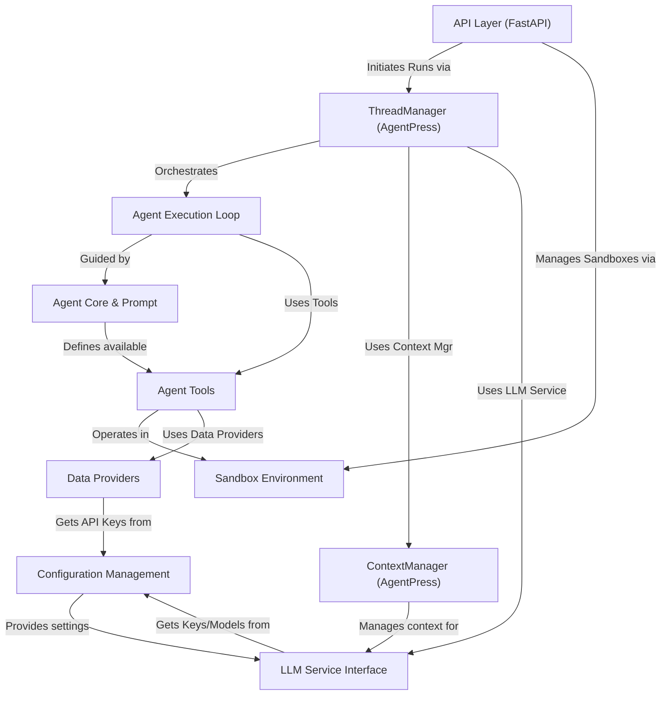

# Tutorial: suna

Suna.so is an **AI agent** designed to perform complex tasks autonomously.
It operates within a secure *sandbox environment* (like a personal workshop) where it can use various *tools* (like apps) such as file editors, web browsers, and command-line utilities.
The agent follows instructions defined in its core prompt and manages tasks through conversation threads, interacting with Large Language Models (LLMs) and external data sources when needed.
A backend system with an **API** manages the agent's execution, configuration, and interactions.

**Source Repository:** [https://github.com/kortix-ai/suna](https://github.com/kortix-ai/suna)

## Chapters

1. [API Layer (FastAPI)
](01_api_layer__fastapi__.md)
2. [Agent Core & Prompt
](02_agent_core___prompt_.md)
3. [Sandbox Environment
](03_sandbox_environment_.md)
4. [Agent Tools
](04_agent_tools_.md)
5. [ThreadManager (AgentPress)
](05_threadmanager__agentpress__.md)
6. [Agent Execution Loop
](06_agent_execution_loop_.md)
7. [LLM Service Interface
](07_llm_service_interface_.md)
8. [ContextManager (AgentPress)
](08_contextmanager__agentpress__.md)
9. [Data Providers
](09_data_providers_.md)
10. [Configuration Management
](10_configuration_management_.md)

---

Generated by [AI Codebase Knowledge Builder](https://github.com/The-Pocket/Tutorial-Codebase-Knowledge)